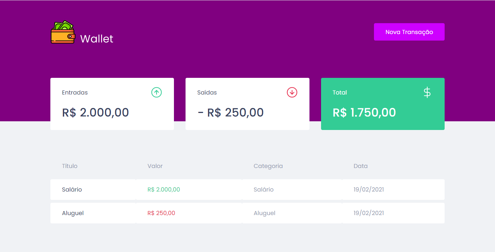

## Iniciando LocalHost
Primeiro, inicie o servidor com os seguintes comandos em seu terminal:

```bash
npm run dev
# or
yarn dev
```
Abra [http://localhost:3000](http://localhost:3000) no seu navegador para ver o resultado.


<h1 align="center">
  { Your Wallet}
</h1>

<p align="center">
  <a href="#-tecnologias">Tecnologias</a>&nbsp;&nbsp;&nbsp;|&nbsp;&nbsp;&nbsp;
  <a href="#-projeto">Projeto</a>&nbsp;&nbsp;&nbsp;|&nbsp;&nbsp;&nbsp;
</p>


<br>

<p align="center">
  
</p>

## 🚀 Tecnologias

Esse projeto foi desenvolvido utilizando:
- ReactJS
- TypeScript
- StyledComponents
- MirageJS

## 💻 Projeto

O Your Finances é uma aplicação feita em react com o objetivo de proporcionar um controle financeiro. Foi desenvolvida durante o módulo 2 do bootcamp Ignite da Rocketseat em 2021. 

## 🧠 Aprendizado

Com esse projeto foi possível aprender sobre styledComponents, criação de contextos no react, criação de hooks, como consumir e como criar uma fake api utilizando MirageJS.

